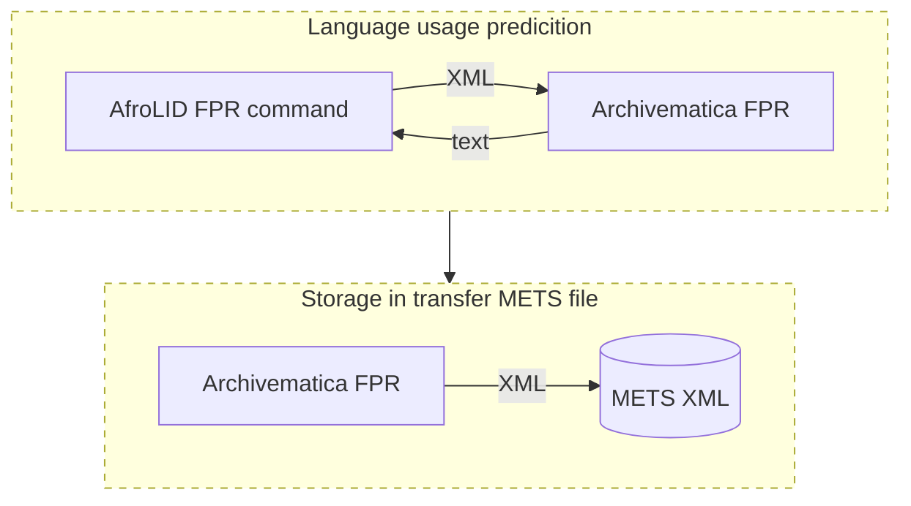

# afrolidxml

This repo contains a Python-based CLI tool (`afrolidxml`) that uses
[AfroLID](https://github.com/UBC-NLP/afrolid) to identify possible African
language usage in a text file then output the results to an XML file.
The tool can be used with Archivematica to identify African languages in text
files, adding characterization metadata to the Metadata Encoding and
Transmission Standard (METS) file of a transfer.

This is done by adding the tool to [Archivematica's][Archivematica]
[Format Policy Registry (FPR)][FPR]
as a characterization command then adding FPR rules that trigger use of the
tool during the characterize and extract metadata microservice
(see [Archivematica configuration](#archivematica-configuration) for FPR
configuration).

[Archivematica]: https://github.com/artefactual/archivematica
[FPR]: https://www.archivematica.org/en/docs/archivematica-1.15/user-manual/preservation/preservation-planning/



This has been tested with Archivematica 1.15.0 running on Ubuntu 22.04.

## Installation

Below are the installation instructions:

1. Clone this project somewhere on your Archivematica server:

    ```shell
    git clone https://github.com/artefactual-labs/afrolidxml.git
    ```

1. Change into the project directory:

    ```shell
    cd afrolidxml
    ```

1. Create a Python virtual environment:

    Install `virtualenv` if it's not already installed:

    ```shell
    sudo apt install python3-virtualenv
    ```

    Initialize a new virtual environment:

    ```shell
    virtualenv -p python3 venv
    ```

1. Activate the virtual environment:

    ```shell
    source venv/bin/activate
    ```

1. Install the project's Python dependencies:

    ```shell
    pip3 install -r requirements/base.txt
    ```

1. Download the AfroLID model:

    Install `wget` if it's not already installed:

    ```shell
    sudo apt install wget
    ```

    Download and extract the model:

    ```shell
    wget https://demos.dlnlp.ai/afrolid/afrolid_model.tar.gz
    tar -xf afrolid_model.tar.gz
    ```

Ideally this could be installed with `pipx`, which installs CLI tools and
automatically creates virtual environments for them, but there's currently
an issue within the dependencies (`fairseq` 0.12.2, currently the latest
version, has a dependency that has a PEP 440-related [issue][issue]).

[issue]: https://github.com/facebookresearch/fairseq/issues/5055

## Running the tool manually

Once the tool is installed it can be run manually to make sure it has been
installed correctly:

```shell
./afrolidxml/cli.py -m afrolid_model \
    tests/fixtures/language_use_example.txt output.xml
```

The resulting output, in `output.xml`, should look similar to this:

```xml
<?xml version="1.0" encoding="utf-8"?>
<languages sourcetool="AfroLID">
        <language>
                <score>39.95</score>
                <name>Isizulu</name>
                <script>Latin</script>
                <code>zul</code>
        </language>
        <language>
                <score>30.49</score>
                <name>Isixhosa</name>
                <script>Latin</script>
                <code>xho</code>
        </language>
        <language>
                <score>11.4</score>
                <name>IsiNdebele</name>
                <script>Latin</script>
                <code>nbl</code>
        </language>
</languages>
```

An XSD XML schema for this, if needed, exists at `tests/fixtures/languages.xsd`
in the repository.

## Archivematica configuration

In the Archivematica dashboard click "Preservation planning", on the navigation
bar, to navigate to the web interface for defining which actions Archivematica
should take on a particular file format.

### Adding the AfroLID tool as a characterization command

Follow these steps to create a characterization command for the AfroLID tool:

1. Click "Commands" in the "Characterization" section of the left sidebar.
1. Click "Create new command".
1. For "The related tool" select "Archivematica Script".
1. For "Description" enter "AfroLID".
1. For "Command" add the following Bash script logic (changing `SCRIPT_DIR` to
   the location where you've cloned this project):

    ```bash
    set -euo pipefail
    SCRIPT_DIR="/home/someuser/afrolidxml"
    cd $SCRIPT_DIR
    source venv/bin/activate
    TEMP_DIR=$(mktemp -d %tmpDirectory%afrolid.XXXXXX)
    $SCRIPT_DIR/afrolidxml/cli.py -m afrolid_model "%fileFullName%" "$TEMP_DIR/output.xml" 1>/dev/null 2>/dev/null
    cat "$TEMP_DIR/output.xml"
    echo
    echo
    rm -r "$TEMP_DIR/output.xml"
    ```

    This Bash script logic suppresses both the standard and error output of the
    AfroLID tool, while it's running, then outputs the resulting XML to standard
    output.

1. For "Script type" select "Bash script".
1. For "The related output format" select "Text (Markup): XML: XML (fmt/101)".
1. Leave "Output location" blank.
1. For "Command usage" select "Characterization".
1. Leave "The related verification command" blank.
1. Leave "The related event detail command" blank.

### Adding characterization rules to run the AfroLID command

After adding the characterization command the next step is to create rules for
the six file formats that we'd like to use AfroLID to characterize.

Add a rule for the first format using these steps:

1. Click "Rules" in the "Characterization" section of the left sidebar.
2. Click "Create new rule".
3. For "Purpose" select "Characterization".
4. For "The related format" select "Text (Plain): Plain Text: Generic TXT
   (x-fmt/111)".
5. For "Command" select "AfroLID".
6. Click "Save".

Repeat steps steps 2 to 6 for the following five formats, changing the "The
related format" selection in step 4 to the format:

* Text (Plain): Unicode Text File: Unicode Text File (x-fmt/16)
* Text (Plain): 7-bit ANSI Text: 7-bit ANSI Text (x-fmt/21)
* Text (Plain): 7-bit ASCII Text: 7-bit ASCII Text (x-fmt/22)
* Text (Plain): 8-bit ANSI Text: 8-bit ANSI Text (x-fmt/282)
* Text (Plain): 8-bit ASCII Text: 8-bit ASCII Text (x-fmt/283)

## Tests

With the virual environment active, install the project's Python test dependencies:

```shell
pip3 install -r requirements/test.txt
```

To run the tests:

```shell
./venv/bin/pytest tests/test.py
```
